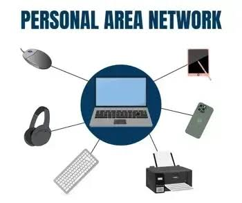
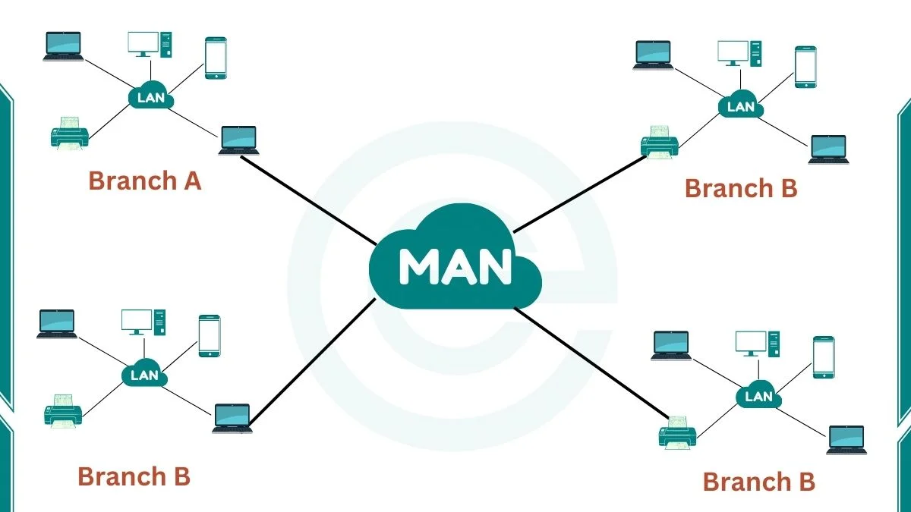
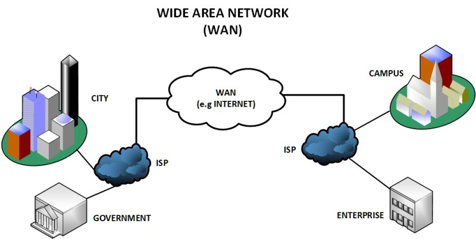

# Introduction to Computer Networking

---

**Computer networking** is the process of connecting computers, servers, and other devices so they can communicate and exchange data with each other. It allows devices to share resources such as **files, applications, printers, and Internet connections**.

Networks can range from a small **personal network** to a massive global network such as the **Internet**.

Understanding computer networking is a fundamental skill for **IT professionals, system administrators, network engineers, cloud engineers, and cybersecurity professionals**.

---

<p align="center">
  
</p>

---

## Network Types Based on Size

Computer networks are commonly classified based on their **geographical coverage and size**.

The four major types of networks are:

| Type | Full Form | Coverage |
|------|-----------|----------|
| **PAN** | Personal Area Network | Personal space |
| **LAN** | Local Area Network | Home, office, building |
| **MAN** | Metropolitan Area Network | City or metropolitan area |
| **WAN** | Wide Area Network | Country or worldwide |

---

# 1. PAN — Personal Area Network

## Definition

A **Personal Area Network (PAN)** is a small network used to connect personal devices within a short range, usually around an individual.

PAN allows devices such as **smartphones, laptops, smartwatches, wireless headphones, and tablets** to communicate and share data.

## How PAN Works

PAN commonly uses technologies such as:

- **Bluetooth**
- **USB**
- **Wi-Fi**
- **Infrared**

These technologies allow personal devices to communicate over a short distance.

<p align="center">
  
</p>

## Example

When you connect your **smartphone to wireless earbuds using Bluetooth**, you are creating a simple PAN.

Another example is connecting a smartphone to a laptop using Bluetooth to transfer files.

## Key Characteristics

- Covers a **very small area**
- Usually centered around **one person**
- Uses technologies such as **Bluetooth and USB**
- Designed for **personal devices**
- Usually has a short communication range

---

# 2. LAN — Local Area Network

## Definition

A **Local Area Network (LAN)** is a computer network that connects multiple devices within a **limited geographical area**, such as a home, office, school, computer lab, or building.

The main purpose of a LAN is to allow connected devices to **communicate and share resources**.

## How LAN Works

In a LAN, devices can be connected using **Ethernet cables or Wi-Fi**.

Network devices such as **switches, routers, and wireless access points** help manage communication between connected devices.

<p align="center">
  
</p>

## Example

A company may have multiple computers, printers, servers, and other devices connected to the same LAN.

Employees can access shared files, communicate with servers, and use shared printers through the network.

## Key Characteristics

- Covers a **small geographical area**
- Provides **high-speed communication**
- Uses **Ethernet or Wi-Fi**
- Allows **resource sharing**
- Usually managed by a **single organization or individual**

---

# 3. MAN — Metropolitan Area Network

## Definition

A **Metropolitan Area Network (MAN)** is a computer network designed to connect multiple **LANs (Local Area Networks)** across a **city or metropolitan area**.

A MAN is **larger than a LAN but smaller than a WAN**.

## How MAN Works

A MAN connects multiple LANs using high-speed communication technologies such as **fiber-optic cables, microwave links, or other high-speed connections**.

<p align="center">
  
</p>

## Example

Suppose a university has several buildings located across a city. Each building has its own LAN.

A **MAN can connect these LANs**, allowing users and systems in different buildings to communicate and share resources.

## Key Characteristics

- Covers a **city or metropolitan area**
- Larger than a **LAN**
- Smaller than a **WAN**
- Connects **multiple LANs**
- Often uses **high-speed communication technologies**
- Can be operated by organizations or telecommunications providers

---

# 4. WAN — Wide Area Network

## Definition

A **Wide Area Network (WAN)** is a computer network that connects multiple networks across a **large geographical area**, such as countries, continents, or even the entire world.

WANs are used to connect **LANs and MANs** located in different geographical locations.

## How WAN Works

WANs use various communication technologies, including:

- **Fiber-optic connections**
- **Leased lines**
- **Satellite communication**
- **Microwave links**
- **Cellular networks**
- **The Internet**

<p align="center">
  
</p>

## Example

A multinational company may have offices in **Nepal, India, the United States, and the United Kingdom**.

Each office has its own LAN. A WAN can connect these different networks so employees and systems in different countries can communicate and access shared resources.

The **Internet** is the largest example of a WAN.

## Key Characteristics

- Covers a **large geographical area**
- Can connect networks across **countries and continents**
- Connects multiple **LANs and MANs**
- Uses technologies such as **fiber, satellite, leased lines, and cellular networks**
- Usually involves multiple network providers or organizations

---

# Comparison of PAN, LAN, MAN, and WAN

| Feature | PAN | LAN | MAN | WAN |
|---------|-----|-----|-----|-----|
| **Full Form** | Personal Area Network | Local Area Network | Metropolitan Area Network | Wide Area Network |
| **Coverage** | Personal space | Building / local area | City | Country / worldwide |
| **Size** | Very small | Small | Medium | Very large |
| **Typical Range** | A few meters | Up to several kilometers | Several to tens of kilometers | Hundreds to thousands of kilometers |
| **Common Technologies** | Bluetooth, USB | Ethernet, Wi-Fi | Fiber, microwave | Fiber, satellite, leased lines |
| **Example** | Phone + smartwatch | Office network | City-wide university network | Internet |

---

# Network Size Overview

```text
PAN  →  LAN  →  MAN  →  WAN
 ↓       ↓       ↓       ↓
Very    Small   City    Large
Small           Area    Area
