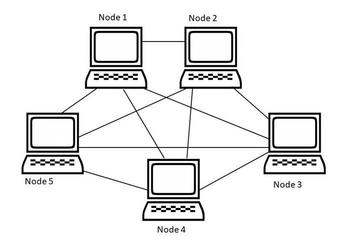

# Network Topology

> **Network topology** is the arrangement of devices (**nodes**) and connections (**links**) in a computer network.

It shows how computers, servers, and other devices are connected and how data flows between them.

Choosing the right topology is important because it affects:

- **Performance**
- **Cost**
- **Reliability**
- **Security**

---

## Types of Network Topology

There are two main types of network topology:

1. **Physical Topology**  
   The actual physical layout of cables and devices.

2. **Logical Topology**  
   How data moves across the network, regardless of the physical layout.

> **Note:** Bus, Star, Mesh, Ring, Tree, and Hybrid are physical topologies. Logical topology refers to how data flows in the network, such as **CSMA/CD** in Ethernet or **token passing** in ring networks.

---

## 1. Point-to-Point Topology

**Point-to-Point Topology** is a type of topology that works on the functionality of the sender and receiver.

It is the simplest communication between two nodes, in which one node is the **sender** and the other node is the **receiver**.

Point-to-Point topology provides **high bandwidth** because the connection is dedicated between two devices.

### Diagram


### Advantages

- Simple and easy to set up
- High data transfer speed because of the dedicated link
- Secure communication through a direct connection
- Low chances of data collision

### Disadvantages

- Not suitable for large networks
- Expensive if many devices need connection
- Limited scalability
- Failure of the link disconnects communication

---

## 2. Mesh Topology

**Mesh Topology** is a network topology in which devices are connected to other devices through dedicated links.



### Number of Ports

If **N devices** are connected in a full mesh topology:

```text
Ports per device = N - 1
