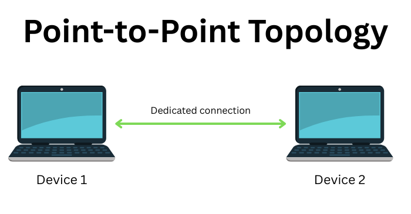
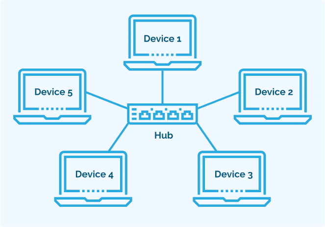
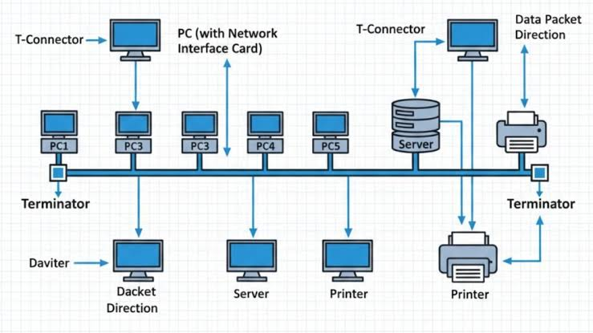
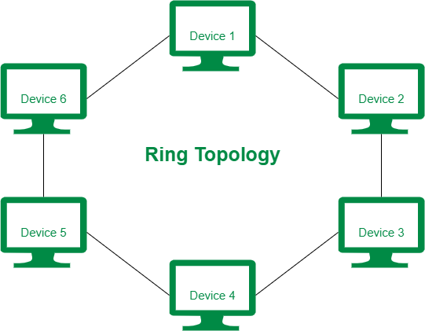
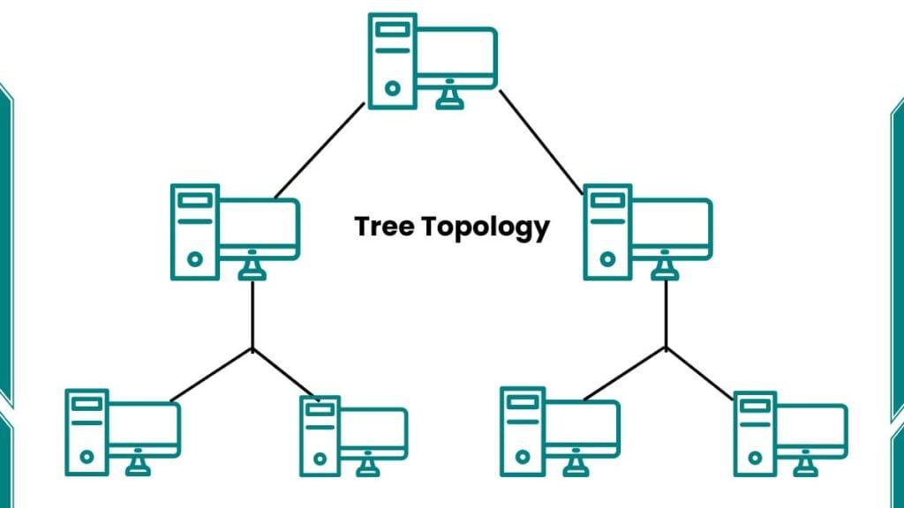
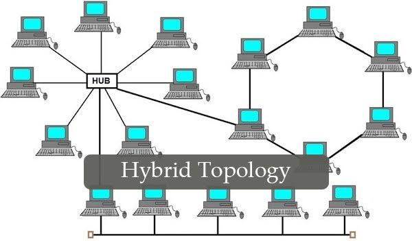

# Network Topology: The Ethical Hacker's Map

> **Network topology** is the arrangement of devices (**nodes**) and connections (**links**) in a computer network.

It describes **how devices are connected** and, in a logical topology, **how data travels between them**.

For an ethical hacker, understanding topology is like a spy understanding a building's floor plan. You need to know:
- **Where the data flows** (to know where to listen).
- **Where the central hubs are** (to know where to focus your defense).
- **Where the redundant paths are** (to know how traffic might evade you).

Choosing the right topology affects:
- **Performance** (How fast can data move?)
- **Cost** (How much cable/equipment is needed?)
- **Reliability** (What happens if a cable snaps?)
- **Scalability** (Can we add more devices?)
- **Security** (Can we isolate sensitive traffic?)
- **Ease of maintenance** (How hard is it to find a fault?)

---

## 📌 Types of Network Topology

Network topology can be classified into two main categories:

### 1. Physical Topology
**Physical topology** describes the actual physical arrangement of network devices, cables, switches, routers, and other components. (What you can touch and see).

Common physical topologies include:
- Point-to-Point
- Bus
- Star
- Ring
- Mesh
- Tree
- Hybrid

### 2. Logical Topology
**Logical topology** describes **how data flows through a network**, regardless of the physical arrangement of devices. (The "rules" of the road).
Examples include:
- **Ethernet** — traditional shared-media Ethernet used **CSMA/CD** (Carrier Sense Multiple Access with Collision Detection).
- **Token-passing networks** — use a token to control access to the network.

> **💡 Important:** A network can have one physical topology (e.g., a Star shape) and a completely different logical topology (e.g., a Ring data flow).

---

# 1. Point-to-Point Topology

**Point-to-Point (P2P) topology** is the simplest type of network topology. It provides a **direct connection between two devices**.

One device communicates directly with the other through a dedicated link.

### 🔑 Key Features
- Connects exactly **two devices**.
- Uses a **dedicated communication link**.
- Provides direct communication.
- Commonly used for **dedicated links and WAN connections** (like a T1 line between two offices).

### Advantages
- Simple to install and configure.
- High performance because the connection is dedicated.
- Low chance of collisions.
- Easy to troubleshoot.
- Good privacy compared with shared links.

### Limitations
- Connects only two devices.
- Not suitable for large networks by itself.
- Adding more devices requires additional links.
- Failure of the link interrupts communication.

### 🧠 Hacker's Mindset
> **Why a hacker cares:** A point-to-point link is a "closed tube." It is very hard to intercept traffic here because no other devices share the wire. However, these links are often used for **backup connections** or **management consoles**. If an ethical hacker finds a P2P link, they know they have found the "VIP corridor"—if you compromise one side, you have direct access to the other, with no firewalls in between.

---

# 2. Mesh Topology

In a **Mesh topology**, devices are connected through multiple links.

In a **Full Mesh**, every device has a dedicated connection to every other device.
A **Partial Mesh** connects only some devices directly, reducing cost while still providing redundancy.

## 🔢 Full Mesh Formula
If `N` devices are connected in a full mesh:
- **Links per device:** `N - 1`
- **Total links:** `N × (N - 1) / 2`
- **Total interfaces/ports:** `N × (N - 1)`

### Example
If there are **6 devices**:
- Links per device = `6 - 1 = 5`
- Total links = `6 × 5 / 2 = 15`
- Total interfaces = `6 × 5 = 30`

### Advantages
- Very high reliability.
- Multiple paths are available (Redundancy).
- Failure of one link does not stop communication.
- Faults can be easier to isolate.
- Suitable for critical networks (e.g., banking backbones).

### Limitations
- Expensive to install.
- Requires a large amount of cabling.
- Configuration can be complex.
- Full mesh is impractical for very large networks.

> **💡 Example:** Partial-mesh designs are commonly used in network backbones and data centers.

### 🧠 Hacker's Mindset
> **Why a hacker cares:** Mesh networks are the hardest to take down. If an ethical hacker is performing a **Denial of Service (DoS)** test, they will struggle to bring down a full mesh because there are too many alternative paths. However, this redundancy is a double-edged sword. It makes **traffic analysis** difficult—because data takes different paths, it is harder to sniff a complete conversation. For a hacker, the focus shifts from disrupting the link to attacking the **routing protocols** that decide which path the data takes.

---

# 3. Star Topology

In a **Star topology**, all devices are connected to a **central networking device**, such as a switch or, in older networks, a hub.

The central device manages communication between connected devices.

## 🔢 Formula
If `N` devices are connected to a central device:
- **Links required:** `N`
- **Central device ports required:** `N`

### 🔑 Key Features
- All devices connect to a central device.
- Each device has its own connection to the center.
- Very common in modern **LANs** (Local Area Networks).

### Advantages
- Easy to install and manage.
- Easy to identify and isolate faults.
- Failure of one cable usually affects only one device.
- Easy to add or remove devices.
- Good performance with modern switches.

### Limitations
- **Failure of the central switch can affect the entire network.** (Single Point of Failure).
- Requires more cable than a bus topology.
- Requires a central networking device.

> **💡 Example:** Most modern office and home Ethernet networks use a **star topology**, with devices connected to a central switch or router.

### 🧠 Hacker's Mindset
> **Why a hacker cares:** The Star topology is the most common, and it has a glaring weakness: the **Central Switch**. For an ethical hacker, this is the "golden goose." If an attacker compromises that central switch, they can see and intercept **all traffic** flowing between every device. Furthermore, because all devices connect to one point, it is easy to perform **network segmentation attacks** if the switch is misconfigured. Defenders must secure this central device aggressively, as it is the single "choke point" of the network.

---

# 4. Bus Topology

In a **Bus topology**, all devices share a **single main communication cable**, known as the **backbone**.

Devices communicate over the same shared medium.

## 🔢 Structure
For a traditional bus network with `N` devices:
- **Main backbone cable:** `1`
- **Connections to the backbone:** Approximately `N`

### 🔑 Key Features
- Uses a shared backbone.
- All devices share the same communication medium.
- Traditional bus Ethernet requires **terminators** (to prevent signals from bouncing back).
- Traditional shared Ethernet used **CSMA/CD** (listen before you talk, and stop if you collide).

### Advantages
- Requires less cable than many other topologies.
- Simple design.
- Relatively inexpensive for small networks.

### Limitations
- **Failure of the backbone can affect the entire network.**
- Performance decreases as traffic increases (collisions).
- Troubleshooting can be difficult.
- Limited scalability.
- **Security is weaker** because devices share the same medium (everyone can hear everyone).

> **💡 Note:** Bus topology was common in older Ethernet networks using coaxial cable (Thinnet/Thicknet). Modern Ethernet LANs generally use **star or extended-star topologies** with switches.

### 🧠 Hacker's Mindset
> **Why a hacker cares:** This is the **easiest topology to hack** but also the most outdated. In a Bus topology, every device receives every signal. An attacker does not need to do anything special to "sniff" traffic; they just plug in and listen to the backbone. For a modern ethical hacker, you will almost never see this in a corporate environment. However, you might find it in legacy **SCADA/Industrial systems** or old building automation. If you see a bus topology during a test, consider it a high-risk, unsecured environment.

---

# 5. Ring Topology

In a **Ring topology**, each device is connected to **two neighboring devices**, forming a closed loop.

Data travels around the ring according to the network's communication method.

## ⚙️ How It Works
In traditional **token-passing networks**:
1. A special frame called a **token** circulates around the ring.
2. A device must obtain the token before transmitting.
3. The device sends its data.
4. After transmission, the token continues around the ring.

### 🔄 Direction of Data
A ring can operate:
- **Unidirectionally** — data travels in one direction.
- **Bidirectionally** — data can travel in both directions (often using a **Dual Ring** for redundancy).

### Advantages
- Predictable access to the network.
- Low chance of collisions in token-based systems.
- Provides consistent performance.

### Limitations
- **Failure of a device or link can disrupt a traditional ring.**
- Adding or removing devices may interrupt the network.
- Less common in modern LANs (used more in older FDDI or SONET/SDH WANs).

### 🧠 Hacker's Mindset
> **Why a hacker cares:** The Ring topology has a critical flaw: it is a continuous loop. If an attacker can disconnect one cable or disable one device, the entire ring "breaks" and traffic stops flowing until it heals. This makes it vulnerable to **physical-layer denial of service**. However, modern rings are often "self-healing" (they reverse direction). For an ethical hacker, this means focusing on the **token** itself. If you can spoof or steal the token, you can effectively control who gets to speak on the network.

---

# 6. Tree Topology

**Tree topology** is a hierarchical network structure that combines characteristics of **star and bus topologies**.

Devices are organized into multiple levels, creating a structure similar to a tree (a hierarchical structure).

## 🌳 Structure
A typical tree topology contains:
- **Root/Core device** (The main trunk).
- **Distribution devices** (The branches).
- **Access devices** (The twigs).
- **End devices** (The leaves).

Data flows between higher and lower levels of the hierarchy.

### 🔑 Key Features
- Hierarchical structure.
- Easy to divide a large network into sections (segments).
- Supports network expansion.
- Common in large organizational networks.

### Advantages
- Supports many devices.
- Easy to organize large networks.
- Network sections can be managed independently.
- Easier to expand than a simple bus network.

### Limitations
- **Failure of an important upper-level device (Root) can affect many devices.**
- Requires more cables and networking equipment.
- Configuration can become complex.

> **💡 Example:** A large organization may use a hierarchical structure where a core network connects distribution switches, which connect access switches and end devices.

### 🧠 Hacker's Mindset
> **Why a hacker cares:** Tree topology is great for **segmentation** (keeping different departments separate). For an ethical hacker, this means the network is structured like a corporate ladder. If you compromise a low-level device (a "leaf"), you cannot reach the CEO's computer (another branch) unless you "climb the tree." The hacker's goal is to pivot upward to the **Distribution** or **Core** layers. If you compromise a Core switch, you own the whole tree. Tree topologies also naturally encourage **VLANs**, which we will study to understand how hackers bypass these hierarchical barriers.

---

# 7. Hybrid Topology

**Hybrid topology** is a combination of **two or more different network topologies**.

For example, a network might combine:
- Star + Bus
- Star + Ring
- Star + Mesh

### 🔑 Key Features
- Combines multiple topology types.
- Flexible network design.
- Suitable for large and complex networks (like global enterprises).
- Can be designed according to specific requirements.

### Advantages
- Highly flexible.
- Easy to expand.
- Can combine the advantages of different topologies (e.g., the redundancy of Mesh with the simplicity of Star).
- Suitable for large organizations.

### Limitations
- More expensive to design and install.
- Network architecture can be complex.
- Troubleshooting can be difficult.
- Maintenance costs can be high.

> **💡 Example:** A university campus may use a combination of **star and mesh designs**, with different buildings connected using different network structures.

### 🧠 Hacker's Mindset
> **Why a hacker cares:** Hybrid networks are the real world. Every large company runs a hybrid topology. For an ethical hacker, this means no single attack works everywhere. You need to map the network carefully. The "hybrid" nature means there are usually **legacy gaps**—an old bus system in one building connected to a modern star system in another. Hackers look for these weak intersections where different "zones" meet, as security controls are often inconsistent at hybrid boundaries.

---

# 📊 Network Topology Comparison (Defensive vs. Offensive View)

| Topology | Main Structure | Reliability | Cost | Scalability | Hacker's Weakness |
|---|---|---|---|---|---|
| **Point-to-Point** | Two devices directly connected | High | Low | Low | If compromised, gives direct access to the far end. |
| **Bus** | Shared backbone | Low | Low | Low | Everyone hears everyone (Easiest to sniff). |
| **Star** | Devices connected to a central device | High (Center) | Medium | High | **Single Point of Failure** (The Central Switch). |
| **Ring** | Devices form a closed loop | Medium | Medium | Medium | Breaks easily if a node goes down; token theft. |
| **Mesh** | Multiple connections between devices | Very High | High | Low–Med | Hard to take down; focus shifts to routing attacks. |
| **Tree** | Hierarchical structure | Med–High | Med–High | High | If you climb to the "Root," you own all branches. |
| **Hybrid** | Combination of topologies | Depends | High | Very High | Weak spots exist where different topologies meet. |

---

# 🎯 Why Is Network Topology Important for an Ethical Hacker?

Network topology determines **how devices are connected and how communication is organized**. As a hacker-in-training, you view these not as diagrams, but as an **attack surface map**.

## 1. 🚀 Network Performance
**Why it matters to a hacker:** If you know the topology, you know where to launch a **traffic flood**. Hitting a Star's central switch with too much data takes down the whole office. Hitting a Mesh network takes down nothing—so you avoid it.

## 2. 🛡️ Network Reliability
**Why it matters to a hacker:** Topologies with high redundancy (like Mesh) are hard to disrupt physically. Ethical hackers must look for the **software vulnerabilities** (like routing protocols) instead of cutting cables.

## 3. 📈 Network Scalability
**Why it matters to a hacker:** As networks scale, administrators often make mistakes in configuration. Large Tree or Hybrid networks usually have **misconfigured VLANs** or forgotten test devices that make excellent entry points.

## 4. 💰 Cost
**Why it matters to a hacker:** If a company cheaped out and used a **Bus** or a weak **Star** topology, they are likely to have cheap, outdated hardware. Outdated hardware = outdated firmware = easier to hack.

## 5. 🔒 Network Security
**Why it matters to a hacker:** A Bus topology has zero privacy. A Star topology keeps traffic private only if the switch is configured correctly. A hacker knows that **physical topology dictates how easy it is to eavesdrop**.

## 6. 🔧 Troubleshooting & Maintenance
**Why it matters to a hacker:** In a Star topology, if you unplug one cable, only one user notices. In a Bus topology, if you unplug the backbone, everyone notices (great for distractions). A hacker uses this knowledge to cause confusion while performing their real attack elsewhere.

---

# 🧠 Quick Revision for the Aspiring Hacker

| Topology | Remember It As | Your #1 Hacking Question |
|---|---|---|
| **Point-to-Point** | 🔗 Two devices, private line. | "Is this a management console I can brute-force?" |
| **Bus** | 🚌 One shared cable, old tech. | "Can I plug in and sniff everything?" |
| **Star** | ⭐ Everything to a central switch. | "Can I compromise the central switch?" |
| **Ring** | 🔄 Data goes in a loop. | "Can I stop the token or break the loop?" |
| **Mesh** | 🕸️ Everyone connects to everyone. | "Can I poison the routing table instead of cutting wires?" |
| **Tree** | 🌳 Hierarchical levels. | "Can I pivot from a leaf up to the root?" |
| **Hybrid** | 🔀 A bit of everything. | "Where is the weakest intersection point?" |

---

## 📌 The Ultimate Takeaway

> **Network topology defines how devices are connected and how communication is organized.**

As an ethical hacker, you don't just memorize these shapes. You use them to **predict behavior**:
- If it's a Star, you protect the center.
- If it's a Mesh, you look for logic flaws.
- If it's a Bus, you sound the alarm.

Understanding topology connects the **physical world** (cables and switches) to the **logical world** (IP addresses and data flows). Master this, and you will never be lost in a network again.

**Next Topic:** Now that you know the *shapes* of networks, we will move on to **IP Addressing and Subnetting** to understand how devices find each other on these topologies!
