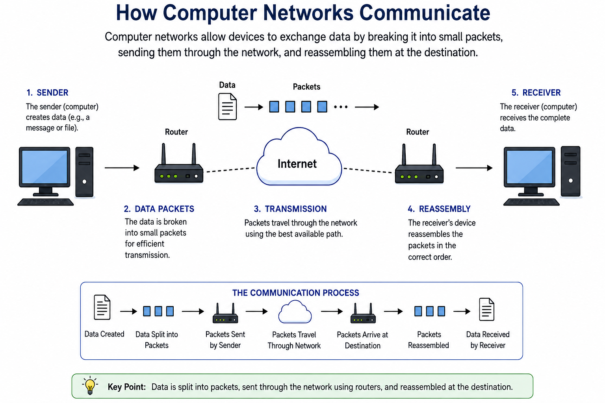
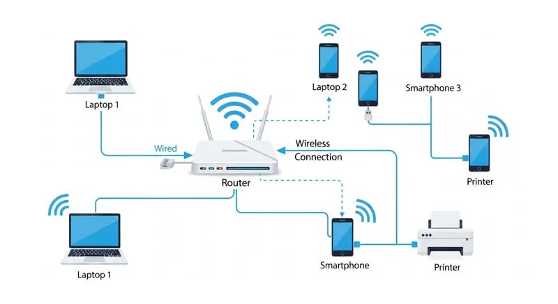

# Introduction to Computer Networking

---

**Computer networking** is the process of connecting computers, servers, and other devices so they can communicate and exchange data with each other. It allows devices to share resources such as **files, applications, printers, and Internet connections**.

Networks can range from a small **home or office network** to a massive global network such as the **Internet**.

Understanding computer networking is a fundamental skill for **IT professionals, system administrators, network engineers, cloud engineers, and cybersecurity professionals**.

---

  

---

## Network Types Based on Size

Computer networks can be classified based on their **geographical coverage and size**.

The major types of networks, from smallest to largest, are:

| Type | Full Form | Typical Coverage |
|------|-----------|------------------|
| **PAN** | Personal Area Network | A few meters |
| **LAN** | Local Area Network | Home, office, building |
| **MAN** | Metropolitan Area Network | City or metropolitan area |
| **WAN** | Wide Area Network | Country or worldwide |

---

## 1. LAN — Local Area Network

### Definition

A **Local Area Network (LAN)** is a computer network that connects multiple devices, such as **computers, servers, printers, and network devices**, within a limited geographical area such as a **home, office, school, or building**.

The main purpose of a LAN is to allow connected devices to **communicate with each other and share resources**.

### How LAN Works

In a LAN, devices are connected using **Ethernet cables or Wi-Fi**.

Network devices such as **switches, routers, and wireless access points** help manage communication between connected devices.

  

### Example

A company's office may have 20 computers, a printer, and a file server connected to the same LAN. Employees can communicate with the server and share the printer over the network.

### Key Characteristics

- Covers a **small geographical area**
- Provides **high-speed communication**
- Uses **Ethernet or Wi-Fi**
- Allows **resource sharing**
- Usually managed by a **single organization or individual**

---

## 2. MAN — Metropolitan Area Network

### Definition

A **Metropolitan Area Network (MAN)** is a computer network designed to connect multiple **LANs (Local Area Networks)** across a **city or metropolitan area**.

A MAN is larger than a LAN but smaller than a WAN.

### Key Characteristics

- Covers a **larger area than a LAN**
- Usually covers a **city or metropolitan area**
- Connects **multiple LANs**
- Often uses high-speed technologies such as **fiber-optic connections**
- Can be operated by an **organization, company, or telecommunications provider**

### Example

Suppose a university has several buildings located across a city. Each building has its own LAN. A **MAN can connect these LANs**, allowing users and systems across different locations to communicate and share resources.

---

